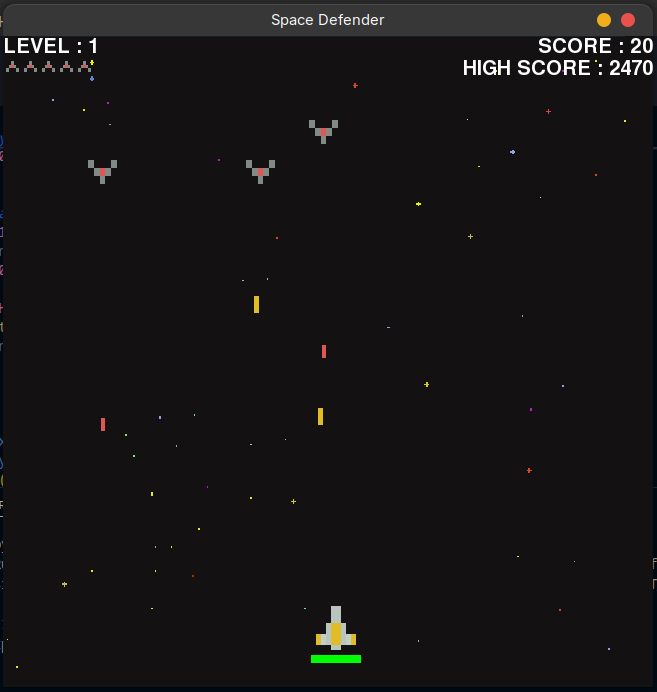
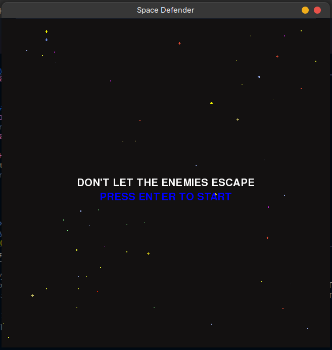

# 🚀 Space Defender

A simple 2D arcade-style space shooter built with **Python** and **Pygame**.

This is my second game project as I continue learning game development. The goal of this project was to improve my understanding of object-oriented programming, collision detection, game loops, enemy AI, and overall game structure.

---

## 🎮 Features

- Player-controlled spaceship
- Multiple enemy ship types
- Laser shooting mechanics
- Collision detection using Pygame masks
- Health system
- Lives system
- Progressive enemy waves
- Increasing difficulty as you survive

---

## 🛠️ Built With

- Python 3
- Pygame

---

## 🎮 Controls

| Key | Action |
|------|--------|
| ← → | Move Left / Right |
| ↑ ↓ | Move Up / Down |
| Space | Shoot |

---

## 📦 Installation

Install Pygame:

```bash
pip install pygame
```

Run the game:

```bash
python main.py
```

---

## 📁 Project Structure

```
Space-Defender/
│
├── assets/
│   ├── background-black.png
│   ├── pixel_ship_*.png
│   ├── pixel_laser_*.png
│   └── ...
│
├── main.py
├── README.md
```

---

## Screenshots




## 📚 What I Learned

While building this project, I practiced:

- Object-Oriented Programming (OOP)
- Game loops
- Event handling
- Collision detection with masks
- Managing multiple game objects
- Structuring a larger Pygame project

---

## 🙏 Credits

This project was inspired by the excellent Pygame tutorials from **Tech With Tim**.

Although I followed the tutorial as a learning resource, I implemented the project myself while studying and experimenting with the concepts.

---

## 🚧 Future Improvements

- Main menu
- Pause functionality
- Sound effects and music
- Boss battles
- Power-ups
- High score saving
- Better enemy AI
- Animations and visual effects

---

## 📄 License

This project is for educational and portfolio purposes.
